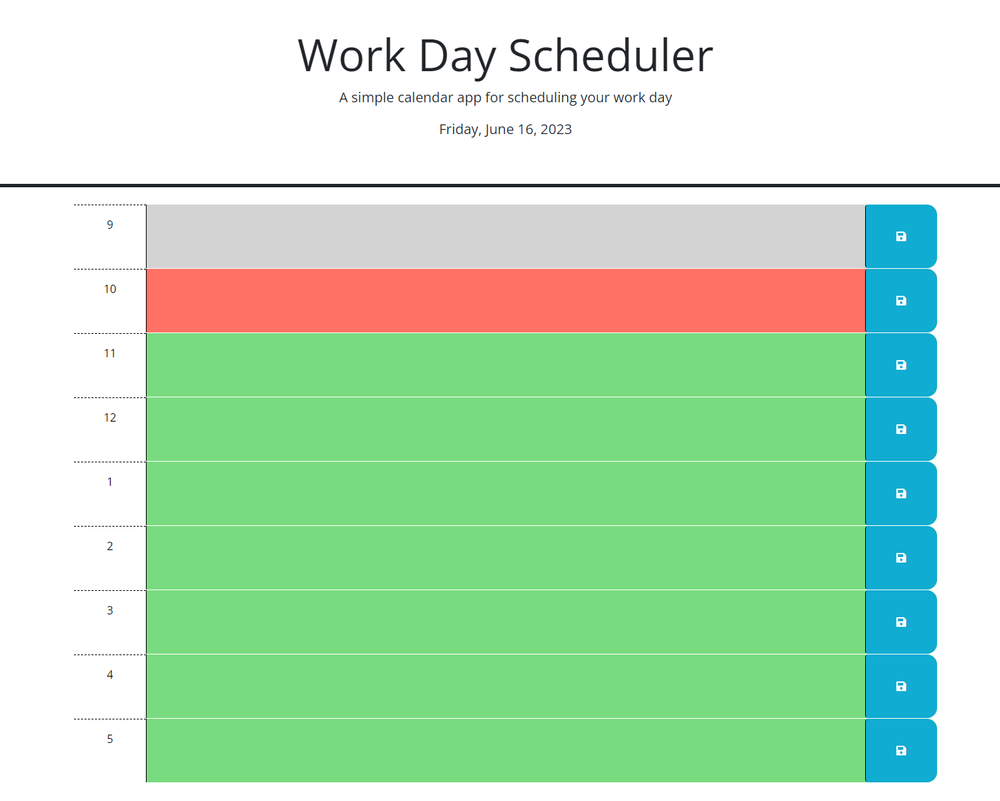

# Work-Day-Scheduler-Challenge05
the work day scehduler was not as intense as i thought it might be, i was able to create a for loop to create each hour block and set the features and colorways by selecting the html semantics 

 var rowDiv=$('<'div>') being the secetor for the div, then addClass adding the classes that will stylize the boxes. 

then use the for loop to set the time for each box. 

I then set a if else statments to check for past present future to then add the correct class that would change the color of the row div accordingly. 
 
 lastly, append everything together at the end in the correct order so i looked right, almost messed up when i appene the icon to the container rather than the button. but it was a quick fix with the help of JD.  

 https://github.com/jonjigoncalves/Work-Day-Scheduler-Challenge05
 https://jonjigoncalves.github.io/Work-Day-Scheduler-Challenge05/
 
 screen shot below.

  

